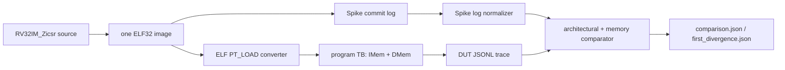

# V1 Spike 差分验证合同

## 1. 状态与目标

> 首个闭环状态（2026-07-27）：已完成。相同的 `RV32IM_Zicsr` ELF 已在 Spike
> 与 Icarus RTL 仿真中运行；smoke 比较 18 个架构事件和 4 个访存事件，首个差异为
> 空，DUT 在 76 周期后以 `tohost=1` 结束。

V1 的目标是建立一个可重复扩展的参考模型差分入口，而不是用一个程序替代 ISA
认证。唯一程序输入是 ELF；Spike 直接执行该 ELF，DUT 则只从同一 ELF 的
`PT_LOAD` 段生成初始存储镜像：



这条闭环不修改 RTL，也不把 testbench 当作第二份 ISA 模型。参考结果来自 Spike，
DUT 侧只导出已经存在的 retire/trap 接口和实际 DMem request 副作用。

## 2. 冻结执行 profile

首版 profile 固定如下：

| 项目 | 固定值 |
|---|---|
| ISA | `RV32IM_Zicsr` |
| ABI | `ilp32` |
| 特权模式 | Machine-only (`--priv=M`) |
| `_start` / DUT reset vector | `0x80000000` |
| DUT reset `mtvec` | `0x80000300` |
| Spike initial `mtvec` | `0x00000000`；不与 DUT 对齐 |
| trap policy | trap-free；任一侧出现 trap 即 mismatch |
| 默认共享镜像窗口 | `0x80000000..0x80003fff`，16 KiB |
| DUT 存储协议 | 每通道最多一笔在途；request 空闲时 ready；下一周期给 response |
| DUT interrupt 输入 | 全部固定为 0 |
| DUT coprocessor | 关闭 |
| 结束协议 | 对 ELF `tohost` 低 32 位的已退休 store；值 1 为 pass |

memory size 是同一次 run 的显式 profile 参数：默认 16 KiB，必须为 4 KiB 倍数；
已验证可以用 `--memory-size 0x100000` 扩到 1 MiB。runner 把同一个值同时传给 ELF
converter、Icarus 顶层参数和 Spike memory region，防止三侧窗口漂移。

由于 Spike 与 DUT 的复位 `mtvec` 不同，首版不比较 trap handler 路径。进入常规事件
比较前，runner 同时检查 Spike architecture trace、DUT architecture trace 和 DUT
summary；任一侧出现 trap，或 DUT summary 的 trap 计数缺失/非零，本轮都以
`trap-free-profile` mismatch 结束。即使两侧 trap cause/tval 恰好相同，也不能据此
宣称 trap、MRET 或 interrupt 差分通过。

Spike 命令显式给出 `--isa`、`--priv`、`--pc`、memory region、instruction limit、
`-l` 和 `--log-commits`。Spike 仍从自己的 `0x1000` boot ROM 启动；解析器丢弃
`0x80000000` 之前的 boot commit，因此它们不进入与 DUT 的比较流。

不使用 `--disable-dtb`：当前 Spike 1.1.1-dev 在该选项与自定义 memory region 的组合
下不能执行 `0x1000` boot ROM，会直接产生 instruction access fault。这个行为是
runner 命令的一部分，不由 DUT 模拟。

## 3. ELF 与存储镜像合同

`scripts/elf_to_mem.py` 只使用 Python 标准库解析 ELF，不依赖 `objcopy` 或平台相关
库。输入必须满足：

1. ELF32、little-endian、`EM_RISCV`；
2. 至少有一个 `PT_LOAD`；
3. 每段 `filesz <= memsz`，文件范围合法；
4. 所有 load range 和 entry point 位于本次 run 冻结的 memory window；
5. 重叠段若写入不同 byte，转换失败；
6. BSS 由 `memsz-filesz` 补零。

输出是 `$readmemh` 可读的 sparse little-endian 32-bit word hex。地址 directive 是
相对于 `--base` 的 word index；零 word 省略，因为 TB 在加载前显式清零整个数组。
可选 metadata JSON 记录 entry、窗口、段、初始化 byte 数和非零 word 数。

默认 linker map 为：

```text
0x80000000..0x80000fff  code / rodata
0x80001000..0x80001fef  data / bss
0x80001ff0               tohost (8-byte aligned)
0x80001ff8               fromhost
0x80002000..0x80003fff  reserved
```

程序 TB 将同一初始 hex 分别加载到 `imem_words` 和 `dmem_words`。两者初值相同，
运行后保持 Harvard 语义：DMem store 不修改 IMem，因此首版不支持 self-modifying
code 或 `FENCE.I` 测试。

## 4. 程序级 TB

`tb/program/tb_rv32_program.sv` 直接实例化 `rv32_core`。顶层 `MEM_BYTES` 是编译期
parameter，默认 16 KiB，接受任意正 4 KiB 倍数；已实际编译并运行 1 MiB 配置：

- IMem、DMem request 在没有 outstanding transaction 时 ready；
- request handshake 后下一周期出现 response，且 response 保持到 ready handshake；
- 每个通道最多一笔在途；
- DMem write 按 `wstrb` 更新 byte lane；
- 窗口外访问返回 error，但 access-fault 差分尚不属于首版通过范围；
- `+MAX_CYCLES` 提供有界失败；
- `+TOHOST` 来自 ELF symbol，不依赖硬编码退出 PC。

顶层已有 retire/trap 端口，但 DMem request 本身不携带发起指令的 PC/insn。为了不改
RTL，TB 在 request handshake 时只读层次引用
`dut.ex_mem_active_candidate.pc/instruction`，将真实副作用绑定到对应指令。该层次引用
是当前验证适配层；若以后顶层增加正式 memory-commit 观察口，应替换这一引用。

同拍 `retire_valid && trap_valid` 时，TB 固定先写 retire、再写 trap，与 D4 的
post-commit interrupt 架构顺序一致。这个顺序只用于保留诊断证据；首版 runner 不
注入 interrupt，并在比较前拒绝任何 trap，因此它不构成 trap/MRET/interrupt 的
差分通过结论。

### 4.1 Plusarg

```text
+MEM_HEX=<sparse word hex>   required
+TRACE=<DUT JSONL path>     required
+TOHOST=<hex address>       default 80001ff0
+MAX_CYCLES=<positive int>  default 20000
```

Icarus 的 memory depth 由 runner 显式固定，例如：

```text
-Ptb_rv32_program.MEM_BYTES=1048576
```

### 4.2 DUT JSONL

TB 输出五种 event：

```json
{"kind":"retire","order":0,"cycle":8,"pc":"0x80000000","insn":"0x00700093","rd_we":1,"rd_addr":1,"rd_data":"0x00000007"}
{"kind":"trap","order":1,"cycle":10,"pc":"0x80000004","cause":"0x00000002","value":"0xffffffff"}
{"kind":"memory","order":0,"cycle":20,"pc":"0x80000014","insn":"0x00322023","write":1,"addr":"0x80001000","wdata":"0x0000003f","wstrb":"0xf"}
{"kind":"memory_response","cycle":21,"pc":"0x80000014","insn":"0x00322023","error":0,"rdata":"0x11223344"}
{"kind":"summary","status":"pass","cycles":76,"retires":18,"traps":0,"tohost":"0x00000001"}
```

`cycle` 只用于定位波形，不参与 Spike 差分。`memory_response` 用于调试 DUT 协议，
也不作为独立架构事件比较。

## 5. Spike 解析与归一化

当前 Spike `-l --log-commits` 对一条新 PC 通常输出一行反汇编和一行 commit；循环
中的已缓存 PC 可能只剩 commit。解析器只接受带 privilege、PC、instruction 的
commit 行，例如：

```text
core   0: 3 0x80000018 (0x00022283) x5  0x0000003f mem 0x80001000
core   0: 3 0x80000014 (0x00322023) mem 0x80001000 0x0000003f
```

解析器执行以下归一化：

1. 从首个 `pc=0x80000000` 开始，过滤 Spike boot ROM；
2. 每个 commit 生成一个 retire event；
3. 仅在 Spike 明确报告 GPR write 且 `rd!=x0` 时比较 `rd_addr/rd_data`；
4. load/store 的 `mem` 字段生成 memory event；
5. SB/SH/SW 根据 instruction、地址 lane 将 Spike store value 归一化为 DUT 的
   `wstrb + shifted wdata`；
6. 看到对 `tohost` 所在 word 的 store 后截断日志，忽略程序的 hang loop；
7. 已识别的同步 exception 转换为 trap cause/tval 供诊断，随后触发 trap-free
   profile mismatch；未知 exception 立即报错。

归一化结果写入 `spike.jsonl`，原始 `spike.log` 始终保留。解析器针对当前实测的
Spike commit 格式，不宣称兼容任意历史或未来版本；manifest 记录实际 executable
路径和完整 argv。

## 6. 比较规则

runner 分别比较两个有序流：

| 流 | 严格比较字段 |
|---|---|
| retire | `kind, pc, insn, rd_we`；写 GPR 时再比较 `rd_addr, rd_data` |
| memory load | `pc, insn, write=false, addr` |
| memory store | `pc, insn, write=true, addr, wstrb, wdata` |

trap 不进入“字段相等即可通过”的比较表；任何 Spike/DUT trap 都先触发
`trap-free-profile` mismatch。其余任一字段或流长度不同即失败。`rd_we=false` 时不
比较 DUT 内部遗留的 rd 编码或
writeback datapath 值，因为它们没有架构效果。CSR write 没有单独的 DUT 观察口；
首版通过后续 CSR readback 的 GPR 结果验证 CSR 状态，而不是解析 Spike CSR token
后假定 DUT 内部状态。

mismatch 时 `first_divergence.json` 包含 stream、index、原因、两侧 event 和前后各
两笔上下文；完整结果保存在 `comparison.json`。setup/tool/trace 错误返回码为 2，
架构不一致或 trap-free profile 违规返回 1，通过返回 0。

显式复用 `--build-dir` 时，runner 在任何参数或工具检查之前生成唯一 `run_id`，并用
同目录临时文件、`fsync` 和 `os.replace` 原子发布本轮初始状态：

- `comparison.json: status=running`；
- `first_divergence.json: status=pending`；
- `manifest.json: status=running`。

因此上一轮的 PASS 或 divergence 不会在本轮已经开始后继续充当决定性结果。正常结束
时，两份结果分别变为 `pass + none` 或 `mismatch + mismatch`；参数、tool、run、trace、
parse 等任一异常则变为 `error + error`。三份 JSON 使用相同 `run_id` 和 UTC
`started_at/finished_at`。若进程被不可捕获地终止，最多留下本轮 `running/pending`，
不会退回上一轮 PASS。runner 只替换自己拥有的三个结果文件，不清空复用目录，也不
删除其中未知的用户文件。

`verification/differential/test_comparator.py` 是必须保留的负测：它复制一份两条
retire 的 JSONL，把第二条 `rd_data` 从 `0x00000009` 故意改为 `0xdeadbeef`，验证
comparator 报告 architecture stream 的 index 1，并能把相同信息写入
`first_divergence.json`。这防止“比较器始终返回 pass”让正常 smoke 产生假阳性。

`verification/differential/test_artifact_lifecycle.py` 先写入陈旧 PASS/divergence，再
分别注入 tool-preflight 和参数错误；它检查 tool 查询发生时旧 PASS 已变为
`running/pending`，并检查错误退出后 comparison/divergence/manifest 全部是同一新
`run_id` 的 error，且没有残留临时文件。

## 7. 首个 smoke 程序

`tb/program/smoke.S` 使用 `.option norvc`，覆盖：

- RV32I 立即数与地址形成；
- RV32M `MUL` 及其依赖；
- `SW -> LW` 和数据相关；
- taken `BEQ` 与 not-taken `BNE`；
- Zicsr `CSRRW/CSRRS` 对 `mscratch` 的写后读；
- 普通 data store；
- `tohost` pass/fail mailbox。

一键运行：

```bash
python3 scripts/run_differential.py --compile-timeout 180
```

`--compile-timeout` 只约束 Icarus RTL 编译，默认 180 秒；`--timeout` 继续约束 ELF
构建、转换、symbol 查询、DUT 运行和 Spike 运行，默认 30 秒。两者都写入 manifest。
这样慢机器或并行编译时不会因为沿用运行阶段的短 timeout 而产生假失败。

指定持久工件目录：

```bash
python3 scripts/run_differential.py \
  --build-dir /tmp/rv32-differential-smoke \
  --max-cycles 2000 \
  --compile-timeout 180
```

扩到 1 MiB 的同值 profile：

```bash
python3 scripts/run_differential.py \
  --memory-size 0x100000 \
  --build-dir /tmp/rv32-differential-1m \
  --compile-timeout 180
```

使用已有 ELF：

```bash
python3 scripts/run_differential.py --elf /absolute/path/program.elf
```

已有 ELF 仍必须满足 `_start=0x80000000`、定义所选窗口内 `tohost`，并与固定 profile
兼容。默认临时工件目录不会自动删除，runner 会打印其绝对路径。

comparator 与工件生命周期负测：

```bash
python3 -m unittest \
  verification/differential/test_comparator.py \
  verification/differential/test_artifact_lifecycle.py
```

## 8. 工件与复现

每次 run 至少保留：

```text
program.elf / program.map      默认 smoke 的唯一 ELF 与 link map
program.hex / image.json       DUT 镜像与 ELF 转换证据
tb_rv32_program.vvp            Icarus binary
dut.jsonl                      DUT 原始事件流
spike.log / spike.jsonl        Spike 原始与归一化事件流
comparison.json                running/pass/mismatch/error 与事件计数
first_divergence.json          pending/none/mismatch/error；mismatch 时含首差异
manifest.json                  run_id、ELF/tool SHA-256、profile、完整 argv、状态
*.stdout / *.stderr            每个子命令的原始日志
```

manifest 的 provenance 不只保存命令路径：

- Git `HEAD`、branch、dirty 标志、tracked/untracked/index/worktree 数量和完整
  porcelain status；
- `filelists/rv32_core_rtl.f` 及其中全部 DUT RTL 的路径与 SHA-256；
- `tb/program/rv32_program_tb.f` 及其中全部 program TB 源的路径与 SHA-256；
- `run_differential.py`、`elf_to_mem.py`、program、linker（或外部 ELF）的 SHA-256；
- 生成 ELF、memory hex、image metadata，以及编译后的 `tb_rv32_program.vvp`
  SHA-256；
- Python、cross GCC、`nm`、Spike、Icarus、`vvp` 的解析后路径与 binary SHA-256。

filelist 若出现 runner 尚未理解的 option/nested 语法会直接报错，不能在 provenance 中
静默漏掉一个编译输入。当前工作树允许 dirty，但 dirty 状态和逐项 porcelain 必须写入
manifest，使 PASS 能绑定到本次实际文件内容，而不是只绑定到 Git HEAD。

首个已验证结果为：

```text
ELF PT_LOAD:       2 segments, 26 nonzero words
DUT:               76 cycles, 18 retire, 0 trap, 4 memory
Spike normalized:  18 retire, 0 trap, 4 memory
comparison:         PASS, first_divergence=null
negative test:      modified retire[1].rd_data detected
```

默认 16 KiB 与显式 1 MiB 两个 memory profile 均复跑得到相同的 18/4 PASS。manifest
同时保存本轮 `run_id`、上述输入/工件 SHA-256 和工具身份；这些 hash 记录本次实际
输入，但不承诺不同平台构建出的 ELF/VVP hash 相同。

## 9. 明确不在首版结论中的内容

以下内容不进入当前 differential pass 声明：

- `mcycle/mcycleh` 等与实现时序有关的 counter 数值；Spike 的指令执行时间不是
  五级 RTL 的 cycle；
- 同步 trap handler、MRET、interrupt 注入/pending/post-commit 顺序；任何 trap 会使
  本 lane 直接 mismatch；
- `WFI` 的等待/唤醒行为；
- instruction/load/store access fault，因为 Spike platform map 与 TB 所选窗口模型
  不同；
- self-modifying code、`FENCE.I`、MMIO、PMP、分页、S/U mode；
- 随机程序、长程序、全部 RV32IM opcode corner case；
- ACT4 认证结果。

因此首个 smoke pass 只证明“该 ELF 的已比较架构/访存事件在当前工具与固定 profile
下一致”。扩大结论必须新增程序集、失败最小化、ACT4 导入和更完整的 CSR/trap 观察
策略，并保持本合同中的同 ELF、显式 profile、首差异工件和证据边界。
