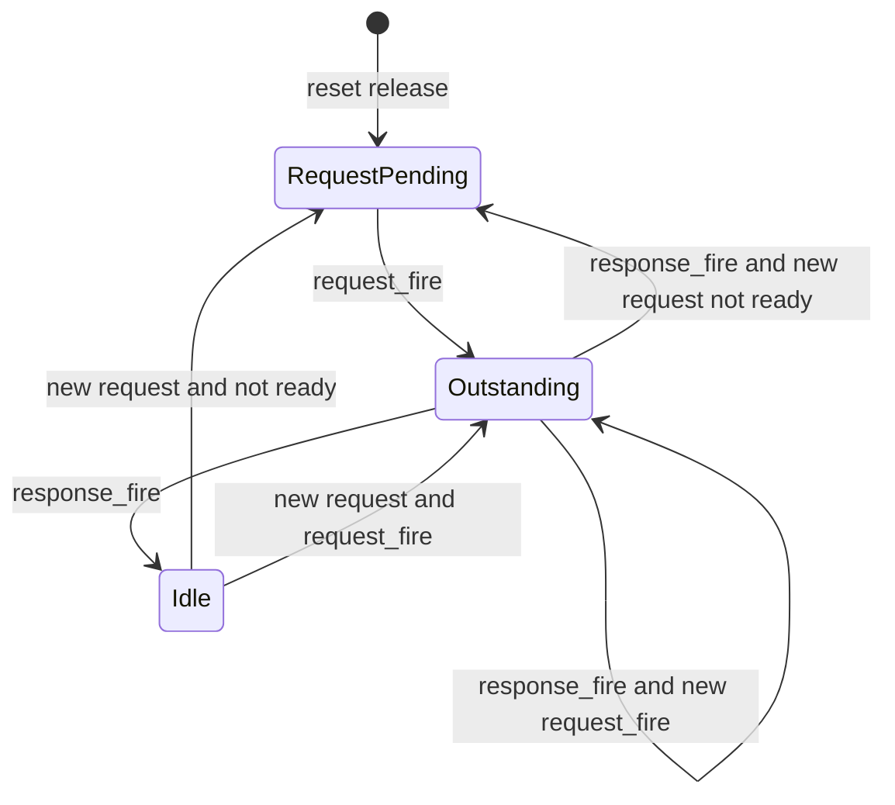

```mermaid
stateDiagram-v2
    [*] --> RequestPending: reset release
    RequestPending --> Outstanding: request_fire
    Outstanding --> Idle: response_fire
    Idle --> RequestPending: new request and not ready
    Idle --> Outstanding: new request and request_fire
    Outstanding --> Outstanding: response_fire and new request_fire
    Outstanding --> RequestPending: response_fire and new request not ready
```